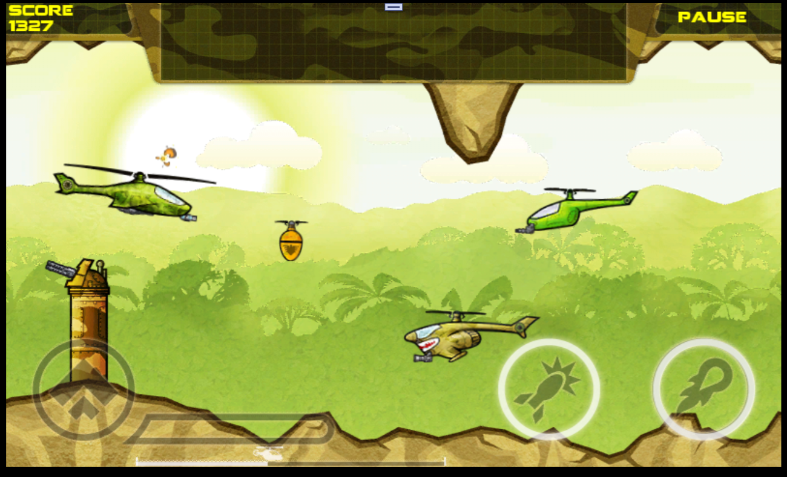
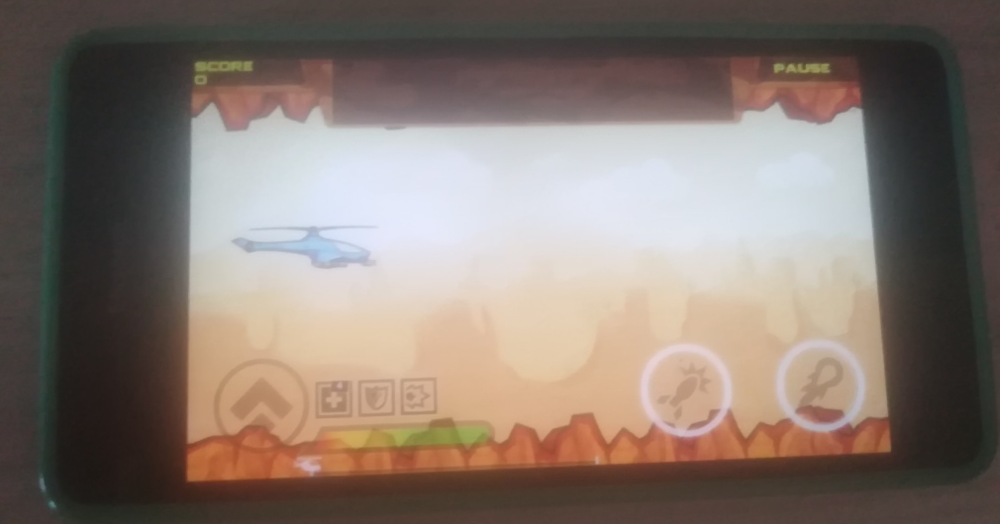
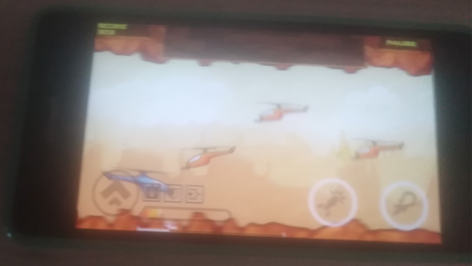

# CombatHelicopter2 v1.0 :: main branch

CombatHelicopter2 decomp. & little RnD

## The preface

On the github on the "channel" of the WPR developer, I accidentally came across such an issue:

https://github.com/8212369/WPR/issues/44

I don't think I have the brains in my WPR fork to provide support for non-standard silverlight games. But in the 21st century, with the help of dotPeek reverse engineering and agent-based development environments like Trae, you can try to port some WP7 games and UWP for Windows10Mobile, Windows 11 or XBox in an hour or two...

## Tech. details
- App type : UWP
- Min. Win. SDK build: 10240 (Hello, Astoria)
- Win. SDK build: 19041
- Touchscreen mode improved (because of game scaling/screen rotating added)
- Mouse/Keyboard controls support added 
- VS 2022 used as IDE for build/test/debug 

## Screenshots

_Windows 11 Tiny_ :

_Windows 10 Mobile_ : 

## Status
- Draft. Only "first" AI-reconstruction & RnD done (some decomp. errors automatically fixed approx. 3 hours of Trae IDE use)
- Game runs in "Desktop" (Windows 11 Tiny OS) successfully, base mouse/kbd support added but gampeplay not tested yet. 
- Game runs in "Mobile" (Windows 10 Mobile OS) successfully too.
- Some non-important things (facebook/tweeter link, etc.) not realized / blocked
- Hardware button "Back" support not fixed yet (restart game if you need to achive start screen again)

## Input controls (Keyboard mode)
- The gameplay screen has introduced the processing of basic actions:
- W/Up — lifting (pinch = hold, release = stop).
  - Space/LeftCtrl — Fire 1.
  - Shift — Fire 2 (not realized yet... Buy mode unlocking needed!)
  - Enter — start the level from the preparation state.
- See more tech. info in /Docs folder.

## TODO
- Add hardware Back Button support for W10M, and "Backspace" handlink for PC mode
- Do additional tests for Desktop/Mobile mode 
- Emulate Marketpace achivements (add money credits after game score increase, forexample)
- Add "god-mode" constant to scr code (and redo "More Games" "magic button" action at Main Screen)))

## ..
As is. No support. DIY. Just for fun!

## References
https://github.com/8212369/WPR/issues/44

[m][e] Jan, 18 2026

